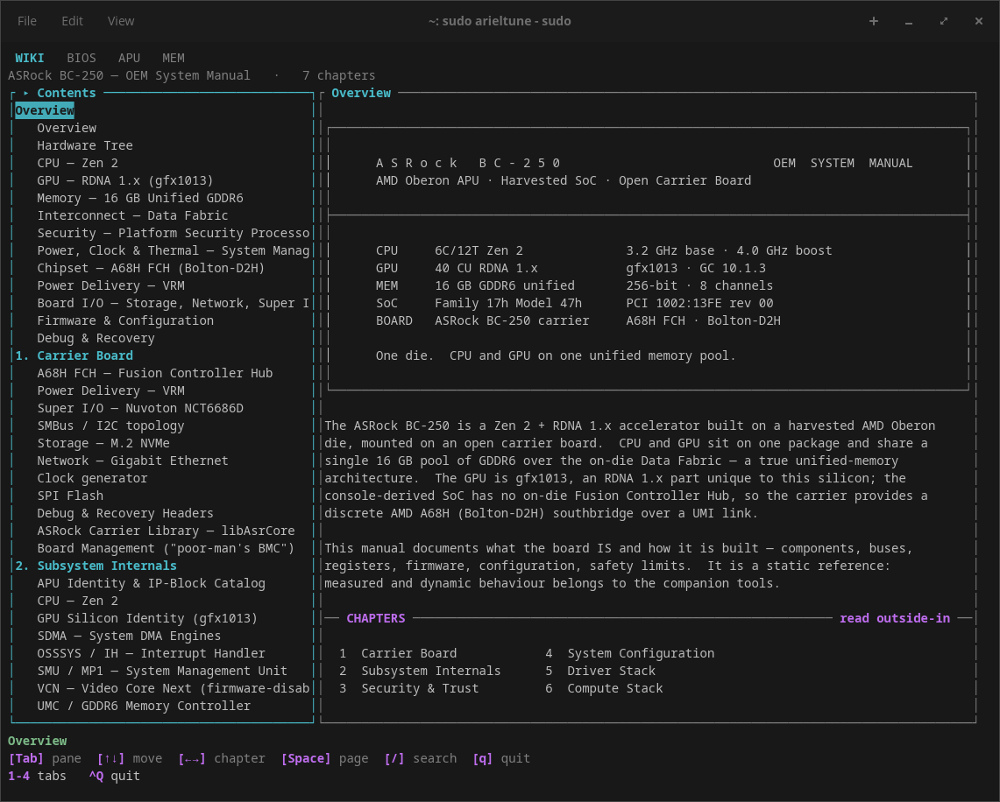
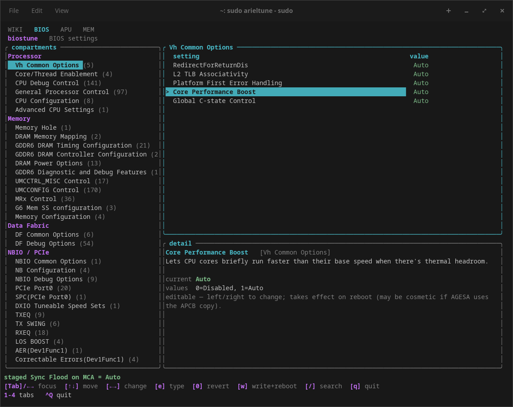
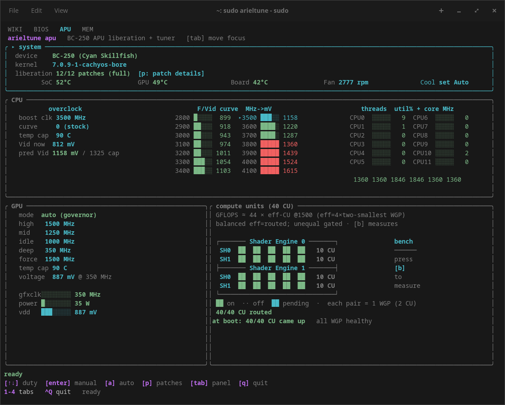
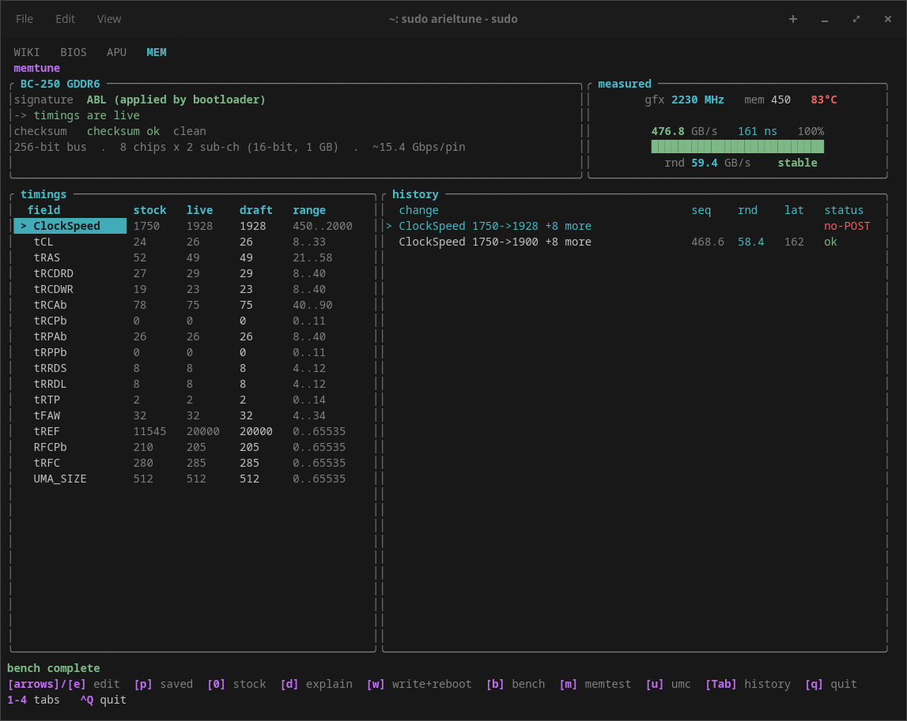

# arieltune

The unified BC-250 tuning suite. One tabbed TUI, with a matching CLI, over four tools:

- **WIKI**: the BC-250 knowledge manual
- **BIOS**: the AMD CBS + OEM Setup surface
- **APU**: APU liberation plus CPU/GPU/CU tuner
- **MEM**: GDDR6 memory-timing tuner

"Ariel" is AMD's codename for the BC-250's APU (Cyan Skillfish, gfx1013). The suite is named for the chip, not the board.

<table>
  <tr>
    <td align="center"><b>WIKI</b><br></td>
    <td align="center"><b>BIOS</b><br></td>
  </tr>
  <tr>
    <td align="center"><b>APU</b><br></td>
    <td align="center"><b>MEM</b><br></td>
  </tr>
</table>

## Why

The stock amdgpu driver keeps the BC-250 harvested: 24 CUs, locked clocks. arieltune ships a curated amdgpu kernel patch series that unlocks all 40 CUs, adds race-free SMU clock control, CPU clock limits, and live telemetry. It drives the whole kernel build and install for you: roughly a 30 minute build plus a reboot, always previewed first, and it only acts with `--run`.

Build the series against `linux-cachyos-bore-7.0.9`. Not 7.0.11+, which regresses BC-250 SDMA. Each of the 12 diffs is explained in `crates/apu/patches/bc250-cachyos-7.0.9/SERIES.md`.

## Quick start

Needs Rust ([rustup.rs](https://rustup.rs)) and sudo.

```sh
./install.sh    # release build + install to /usr/local/bin
arieltune       # launch the TUI (opens on WIKI)
```

Installs one binary, an `at` alias, and `aputune`/`memtune`/`biostune`/`wikitune` compat symlinks.

```sh
arieltune apu          # jump straight to a tab (or: arieltune --tab mem)
arieltune apu <cmd>    # per-app CLI
```

TUI keys: `1`-`4` (or `F1`-`F4`) jump tabs, `Ctrl-Tab` cycles, `Ctrl-Q` quits.

## The one rule

**arieltune must be the only thing driving the SMU.** The APU tab talks to the GPU/CPU power silicon over the single SMU (MP1) mailbox. A second actuator racing it means crippled throughput, wrong clocks, or a wedged GPU that needs a power-cycle. Install on a clean Linux, or first remove any competing clock/power controllers (old `dpm_daemon`, `bc250_smu`, miner clock tools, corectrl, cpupower governors) and reboot.

Also know: the APU, MEM, and BIOS tabs write real hardware (SMU, CMOS/NVRAM, SPI flash). A bad value can fail to POST and need a CMOS-clear. Actuation requires root, the 40-CU and telemetry features require the patched amdgpu, and you use this at your own risk.

## Acknowledgments

arieltune stands on prior BC-250 community work. With thanks:

- **the bc250-collective** (**mrfrakes** and **dantistnfs**) for starting the BC-250
  effort - the original board bring-up, SMU mailboxing, and enablement groundwork that
  everything here builds on.
- **duggasco** for the CU-unlock research - the 40-CU enumeration/dispatch investigation
  on Cyan Skillfish.
- **WinnieLV** for the BC-250 live CU manager, whose proven `apply_target_masks` register
  sequence this project ports (`crates/apu/src/curoute.rs`).
- **ethkey** for sharing the memory-timing tool and timing configurations the **MEM** tab
  is built on; the ASRock `bc250_memcfg` tool and the RobinMemTiming work for the CMOS
  layout and timing semantics; and **walkjivefly** for taking the first plunge.

Building on that, we contribute our **CU map** back to the commons - the shader-array
topology and the empirical dispatch model (`effective_CU = 4 × min(SE0, SE1) WGP total`,
i.e. throughput is gated by the weaker shader engine) that predicts real throughput from a
CU routing. See [`docs/bc250-cu-map.md`](docs/bc250-cu-map.md).

## License

GPL-2.0-only for the whole suite, matching upstream cachenetics/project-ariel.
Kernel-derived subtrees (`crates/apu/patches`, `crates/apu/kmod/nct6687-bc250`,
`crates/bios/driver`) remain GPL-2.0 — the same license. See `LICENSE` and
`THIRD_PARTY_NOTICES`.
