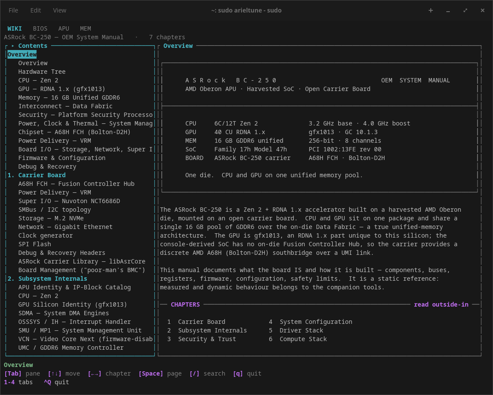
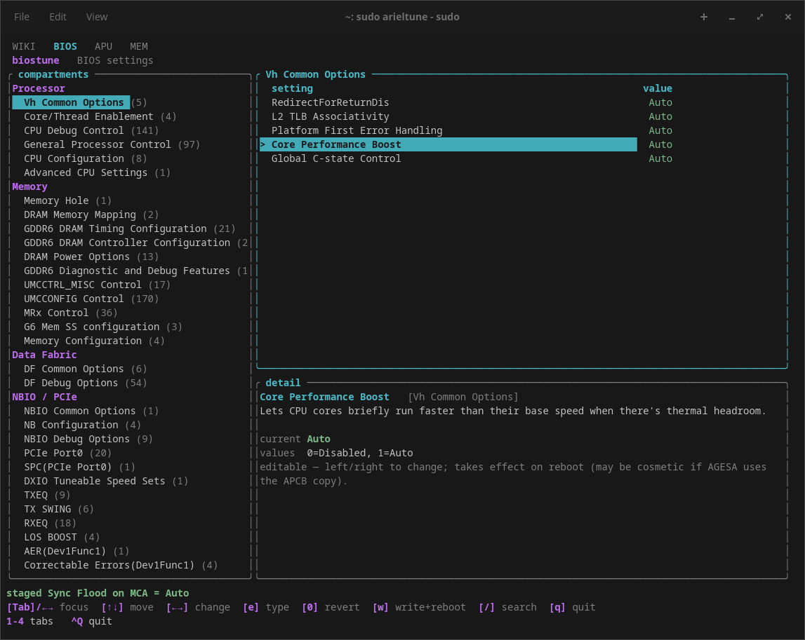
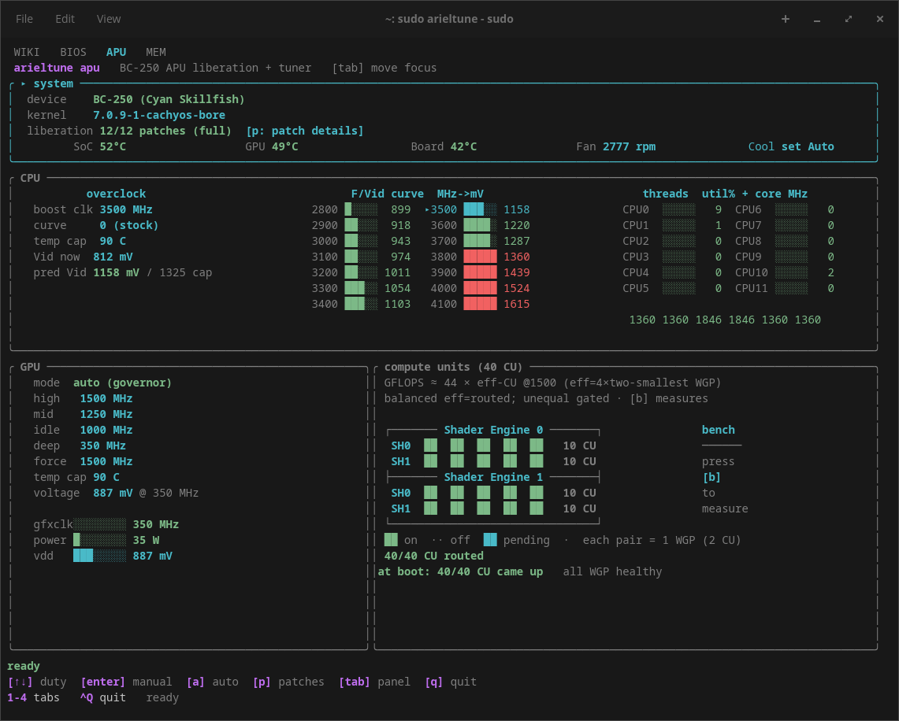
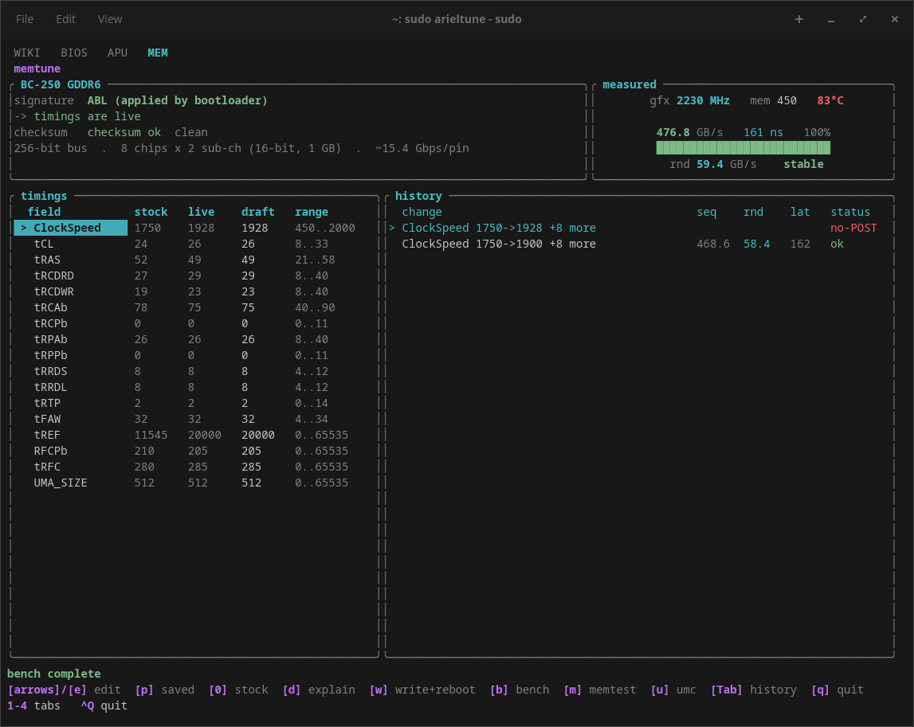

# arieltune

The unified BC-250 tuning suite. One tabbed TUI, with a matching CLI, over four tools:

- **WIKI**: the BC-250 knowledge manual
- **BIOS**: the AMD CBS + OEM Setup surface
- **APU**: APU liberation plus CPU/GPU/CU tuner
- **MEM**: GDDR6 memory-timing tuner

"Ariel" is AMD's codename for the BC-250's APU (Cyan Skillfish, gfx1013). The suite is named for the chip, not the board.

<table>
  <tr>
    <td align="center"><b>WIKI</b><br></td>
    <td align="center"><b>BIOS</b><br></td>
  </tr>
  <tr>
    <td align="center"><b>APU</b><br></td>
    <td align="center"><b>MEM</b><br></td>
  </tr>
</table>

## Why

The stock amdgpu driver keeps the BC-250 harvested: 24 CUs, locked clocks. arieltune ships a curated amdgpu kernel patch series that unlocks all 40 CUs, adds race-free SMU clock control, CPU clock limits, and live telemetry. It drives the whole kernel build and install for you: roughly a 30 minute build plus a reboot, always previewed first, and it only acts with `--run`.

Build the series against `linux-cachyos-bore` 7.2.9-1 (the `linux-cachyos-bore/` PKGBUILD dir - the plain `linux-cachyos/` dir builds a kernel release string the prebuilt nct6687 fan-telemetry module's vermagic won't match; the prebuilt module must match whichever release you target). 7.0.9 is retired: the SDMA regression in 7.0.10-13 that motivated the old pin is fixed in 7.2.9, and 7.0.9 now fails to build at all under a current rustc, because its config sets `CONFIG_RUST=y` while `scripts/generate_rust_target.rs` hard-codes the pre-rename `x86-softfloat` target ABI that rustc 1.99+ rejects. The series lives in `crates/apu/patches/bc250-cachyos-7.2.9/`; every diff and what it does is explained in `SERIES.md` (patches that are on disk but not applied are marked there).

### Build dependencies

On Arch/CachyOS the distro Rust toolchain is enough — no rustup needed. On other
distros, install Rust via [rustup.rs](https://rustup.rs) first. The patched-kernel
build then needs `gcc15`, `bc`, `base-devel`, the clang + thinLTO toolchain
(`clang`, `llvm`, `lld`, `pahole`), and the kernel-Rust pieces (`rust`,
`rust-bindgen`, `rust-src` — the shipped 7.2.9 config has `CONFIG_RUST=y`).
`mkinitcpio` ships by default on CachyOS. On a fresh install, sync mirrors first - a live
ISO's package database can be stale enough that a needed package 404s:

```sh
sudo pacman -Syyu
sudo pacman -S --needed gcc15 bc base-devel clang llvm lld pahole rust rust-bindgen rust-src
```

`arieltune apu build` pre-flight-checks the toolchain before touching anything and
aborts in seconds with the exact missing packages instead of failing deep into the
~30 minute build.

#### Kernel Rust on a newer rustc

The shipped 7.0.9 config has `CONFIG_RUST=y`, and older kernels hard-code the Rust
target-spec ABI in `scripts/generate_rust_target.rs` as `x86-softfloat` — a
spelling rustc has since renamed to `softfloat`. A rustc new enough to reject the
old name kills the build before it produces anything, inside `prepare()`
(`rust/Makefile` -> `rust/core.o`):

```
error: error loading target specification: rustc-abi: invalid rustc abi:
'x86-softfloat'. allowed values: 'x86-sse2', 'powerpc-spe', 'softfloat'
```

`x86-sse2` appears in that list but is **not** the replacement — x86-64 rejects it
with *invalid x86-64 Rust-specific ABI and `cfg(target_abi)` combination*.
`softfloat` is the renamed value, and is what rustc's own builtin
`x86_64-unknown-none` spec already carries.

This is toolchain skew, not a project-ariel bug: `rust`, `rust-bindgen` and
`rust-src` are installed exactly as documented above, and the build still fails.

`aputune build` fixes it, and tells you which case you are in:

```
kernel Rust: rustc accepts the kernel's target ABI (softfloat)
kernel Rust: rustc rejects the kernel's target ABI (x86-softfloat) — injected
             0002-rust-abi-rename.patch; CONFIG_RUST stays on and the PKGBUILD is
             restored when this build ends
```

It never guesses versions — it asks rustc. It reads rustc's own builtin target
spec, forces the ABI value to the kernel's spelling, and asks rustc to load the
result. If rustc accepts it, nothing is changed — so a newer bore kernel that no
longer needs the fix is handled with no change to arieltune.

Kernel Rust is **kept on**: the fix renames the ABI value rather than disabling
Rust. The patch travels through `source[]`/`b2sums[]` because that is the only
channel the PKGBUILD's own `prepare()` applies before the build reaches
`rust/core.o`. `config` is left untouched, the PKGBUILD is restored byte for byte
when the build finishes, and `aputune patches` still counts only the liberation
series — this shim unlocks no silicon and carries no runtime tell.

## Quick start

Needs Rust (see *Build dependencies* above) and sudo.

```sh
git clone https://github.com/cachenetics/project-ariel.git
cd project-ariel
./install.sh    # release build + install to /usr/local/bin
arieltune       # launch the TUI (opens on WIKI)
```

Installs one binary, an `at` alias, and `aputune`/`memtune`/`biostune`/`wikitune` compat symlinks.

```sh
arieltune apu          # jump straight to a tab (or: arieltune --tab mem)
arieltune apu <cmd>    # per-app CLI
```

TUI keys: `1`-`4` (or `F1`-`F4`) jump tabs, `Ctrl-Tab` cycles, `Ctrl-Q` quits.

### Liberation quick start (patched kernel)

The end-to-end flow from a fresh CachyOS BC-250 to a fully unlocked board:

1. **BIOS**: set *UMA Frame Buffer Size* to **512M**. A different carve (e.g. 2G)
   breaks IP discovery and every PSP firmware load (`LOAD_IP_FW ... 0xFFFF0008`) —
   failures that look like patch bugs. The preflight reads the live carve and
   blocks the build until the BIOS is fixed.

2. **Pin the linux-cachyos-bore PKGBUILD** (arieltune cannot fetch this itself):

   ```sh
   git clone https://github.com/CachyOS/linux-cachyos.git ~/linux-cachyos
   git -C ~/linux-cachyos checkout 791fb8ea6d3cf7c85e596678c25c56fa140591be   # 7.0.9-1
   ```

3. **Arm the fleet kernel command line.** Without it the PSP rejects every
   firmware load and most patch features report dead. CachyOS installs default
   to GRUB, but a fresh install can also come with Limine instead - if you are
   not sure which you have, `test -f /etc/default/grub && echo grub || echo limine`.

   **GRUB:**

   ```sh
   sudo sed -i 's|^GRUB_CMDLINE_LINUX_DEFAULT=.*|GRUB_CMDLINE_LINUX_DEFAULT="nowatchdog nvme_load=YES splash loglevel=3 amdgpu.ppfeaturemask=0xfff77ef7 amdgpu.noretry=0 amdgpu.gpu_recovery=1 amdgpu.sched_hw_submission=2 mitigations=off ttm.pages_limit=3588867 ttm.page_pool_size=3588867 iommu=pt amd_iommu=on amdgpu.bc250_flush_by_runlist=1 amdgpu.bc250_sdma_fw=navi12"|' /etc/default/grub
   sudo grub-mkconfig -o /boot/grub/grub.cfg
   ```

   The `sed` replaces `GRUB_CMDLINE_LINUX_DEFAULT` wholesale - that is the fleet
   baseline. If your host carries other boot flags (disk encryption, `resume=`,
   GPU quirks), merge them into the same line manually instead of clobbering
   them. `mitigations=off` is a throughput choice for dedicated inference
   blades, not a liberation requirement: omit it (keep the kernel's default
   mitigations) if the host is not a dedicated inference box.

   **Limine:** edit `/etc/default/limine` and set the same flags on the
   `KERNEL_CMDLINE[default]` entry ([CachyOS's own bootloader-config docs](https://wiki.cachyos.org/configuration/boot_manager_configuration/)):

   ```
   KERNEL_CMDLINE[default]="nowatchdog nvme_load=YES splash loglevel=3 amdgpu.ppfeaturemask=0xfff77ef7 amdgpu.noretry=0 amdgpu.gpu_recovery=1 amdgpu.sched_hw_submission=2 mitigations=off ttm.pages_limit=3588867 ttm.page_pool_size=3588867 iommu=pt amd_iommu=on amdgpu.bc250_flush_by_runlist=1 amdgpu.bc250_sdma_fw=navi12"
   ```

   then `sudo limine-mkinitcpio` to apply. Same caveats as GRUB above: merge in
   any existing flags instead of clobbering them, and drop `mitigations=off`
   unless this is a dedicated inference box.

4. **Preview, then run the build** (~30 minutes; nothing is touched without `--run`):

   ```sh
   sudo aputune build --pkgbuild ~/linux-cachyos/linux-cachyos-bore          # preview
   sudo aputune build --pkgbuild ~/linux-cachyos/linux-cachyos-bore --run    # go
   ```

5. **Reboot and verify**:

   ```sh
   sudo reboot
   sudo aputune doctor        # expect all checks live and 40/40 CUs
   ```

The build installs the kernel, arms `/etc/modprobe.d/aputune-40cu.conf`, and
regenerates the initramfs for you.

## What gets unlocked

| Feature | Where | Notes |
|---|---|---|
| **40-CU GPU unlock** | `sudo aputune build --run` + reboot | `aputune doctor` verifies 40/40 CUs active |
| **8-core CPU unlock** | `arieltune apu cores` / TUI Core Map | Per-core control: deactivate the factory-set cores, force-unlock abnormal core layouts, Core Map view of the shader-array topology |
| **SDMA firmware override** | automatic (build) | navi12 SDMA blobs + early TRAP enable, armed via `/etc/modprobe.d/aputune-40cu.conf` |
| **Race-free clock control** | `arieltune apu` TUI / CLI | SMU gfxclk/cclk soft limits with live telemetry |
| **PMFW telemetry** | `arieltune apu` | Clocks, WGP states, pstates, voltages (debugfs nodes shipped by the series) |
| **Memory tuning** | `arieltune mem` | GDDR6 timing tuner (CMOS-backed) |
| **Firmware surface** | `arieltune bios` | AMD CBS + OEM Setup surface |

Every TUI tab has a matching CLI (`aputune`, `memtune`, `biostune`, `wikitune`).

## The one rule

**arieltune must be the only thing driving the SMU.** The APU tab talks to the GPU/CPU power silicon over the single SMU (MP1) mailbox. A second actuator racing it means crippled throughput, wrong clocks, or a wedged GPU that needs a power-cycle. Install on a clean Linux, or first remove any competing clock/power controllers (old `dpm_daemon`, `bc250_smu`, miner clock tools, corectrl, cpupower governors) and reboot.

Also know: the APU, MEM, and BIOS tabs write real hardware (SMU, CMOS/NVRAM, SPI flash). A bad value can fail to POST and need a CMOS-clear. Actuation requires root, the 40-CU and telemetry features require the patched amdgpu, and you use this at your own risk.

## Acknowledgments

arieltune stands on prior BC-250 community work. With thanks:

- **the bc250-collective** (**mrfrakes** and **dantistnfs**) for starting the BC-250
  effort - the original board bring-up, SMU mailboxing, and enablement groundwork that
  everything here builds on.
- **duggasco** for the CU-unlock research - the 40-CU enumeration/dispatch investigation
  on Cyan Skillfish.
- **WinnieLV** for the BC-250 live CU manager, whose proven `apply_target_masks` register
  sequence this project ports (`crates/apu/src/curoute.rs`).
- **ethkey** for sharing the memory-timing tool and timing configurations the **MEM** tab
  is built on; the ASRock `bc250_memcfg` tool and the RobinMemTiming work for the CMOS
  layout and timing semantics; and **walkjivefly** for taking the first plunge.

Building on that, we contribute our **CU map** back to the commons - the shader-array
topology and the empirical dispatch model (`effective_CU = 4 × min(SE0, SE1) WGP total`,
i.e. throughput is gated by the weaker shader engine) that predicts real throughput from a
CU routing. See [`docs/bc250-cu-map.md`](docs/bc250-cu-map.md).

## License

GPL-2.0-only for the whole suite, matching upstream cachenetics/project-ariel.
Kernel-derived subtrees (`crates/apu/patches`, `crates/apu/kmod/nct6687-bc250`,
`crates/bios/driver`) remain GPL-2.0 — the same license. See `LICENSE` and
`THIRD_PARTY_NOTICES`.
